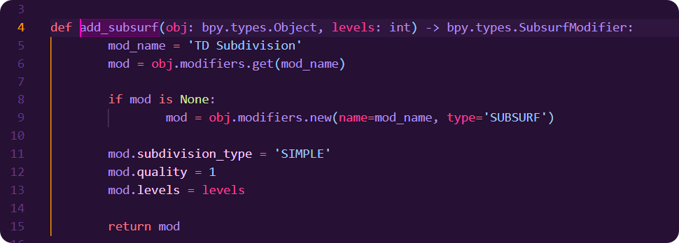

# Purple Colony Theme

A *real* Purple Theme (Dark) with some accent colors.

I use use it for Python, with Pylance for semantic highlighting, which has some issues with VScodium but the theme should still look very similar without it. Hopefully looks nice on other languages as well.

## Images

*(Some colors require semantic highlighting)*

## Links

- [ArmoredColony] - My latest stuff (assets, plugins, tutorials).

- [Artstation] 	- Personal artwork made in ZBrush, Blender, and others.

- [Blender Market] - Blender oriented products.

- [Youtube] 	- Announcements, tutorials, tips and tricks.

[ArmoredColony]: https://armoredcolony.com
[Artstation]: https://www.artstation.com/armoredcolony
[Blender Market]: https://blendermarket.com/creators/armoredcolony
[Youtube]: https://youtube.com/armoredcolony